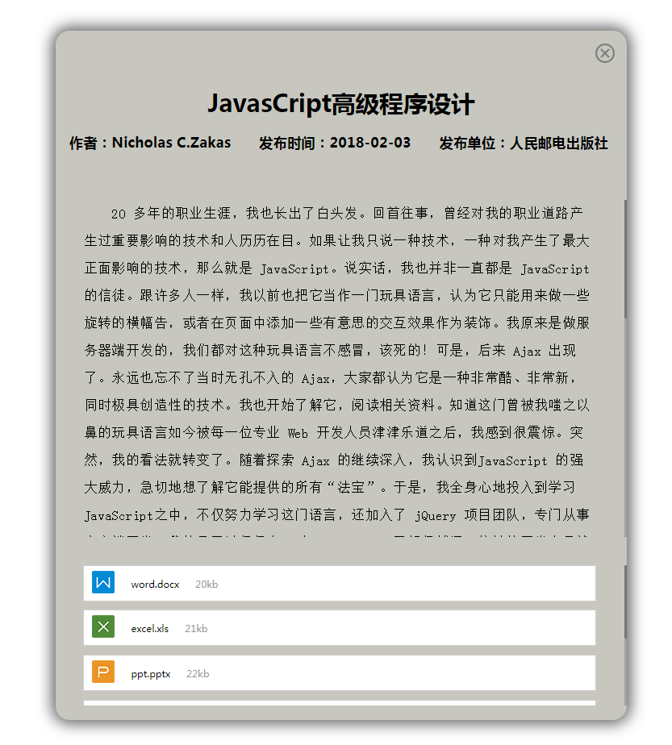

# announcement




# 介绍

基于 jquery 的公告插件，支持图片路径、背景颜色、z-index、文件上传、beforeLoad、afterLoad 等参数配置。支持公告内容和间距随着 viewport 宽高变化而动态变化，但有最大最小值，支持的附件类型有：word、excel、ppt、pdf、txt、unknown


# 浏览器兼容性

- 不支持 Opera Mini
- 兼容 IE>=9。IE9、IE10 需要添加 pointer-events 的 [Polyfill 文件](https://github.com/kmewhort/pointer_events_polyfill) 


# 运行测试文件

1. npm install
2. 浏览器打开 `/test/test.html`，如需在 IE 环境下测试请添加 [Polyfill 文件](https://github.com/kmewhort/pointer_events_polyfill)，修改 `/test/test.js` 为 `/test/test-IE.js`


# 使用

1. 引入 `announcement.min.css` `jquery.min.js` `announcement.min.js`
  ```html
  <!DOCTYPE html>
  <html>
  	<head>
      	<meta charset="utf-8">
        	<meta name="viewport" content="width=device-width, initial-scale=1, maximum-scale=1">
        	<title>announcement</title>
        	<link rel="stylesheet" href="../dist/announcement.min.css">
     	</head>
  	<body>
       	<script src="./jquery.min.js"></script>
        	<script src="../dist/announcement.min.js"></script>
      </body>
  </html>
  ```

2. 在页面放置以下 dom 结构

     ```html
        <div class="announcement-panel">
     	<div class="announcement-content"></div>
        </div>
     ```

3. ajax 回调成功或异步事件完成后进行插件初始化，弹出公告

  ```js
  announcement.initAnnouncement({
    data: data,
    imgPath: "../images",
    backgroundColor: "",
    zIndex: "1000",
    fileDownload: function(value) {},
    beforeLoad: function() {},
    afterLoad: function() {}
  });
  ```


## options

1. `data`

   json 格式的数据，需要遵循以下格式：

   ```
   {
     "dataMap":{
       "puborgid":"人民邮电出版社", //发布单位
       "title":"JavasCript高级程序设计", //标题
       "authorid":"Nicholas C.Zakas", //发布人
       "content":"", //公告内容
       "pubdate":"2018-02-03" //发布日期
     },
     "listDataMap":[{
       "filename":"18012000000001.docx", //文件内部名
       "displayname":"word.docx", //文件展示名
       "fileid":18012000000001, //id，用于文件下载
       "filesize": "20kb" //文件大小
     }]
   }
   ```

2. `imgPath`

   图标等图片存放路径

3. `backgroundColor`

   公告背景色，默认为 `#c7c7bf` ，目前仅支持十六进制颜色

4. `zIndex`

   图层 z-index，默认为 1000，内部使用 parseInt() 进行 String 转十进制 Number 类型

5. `fileDownload`

   文件下载调用此方法

6. `beforeLoad`

   公告渲染之前调用此方法

7. `afterLoad`

   公告渲染之后调用此方法